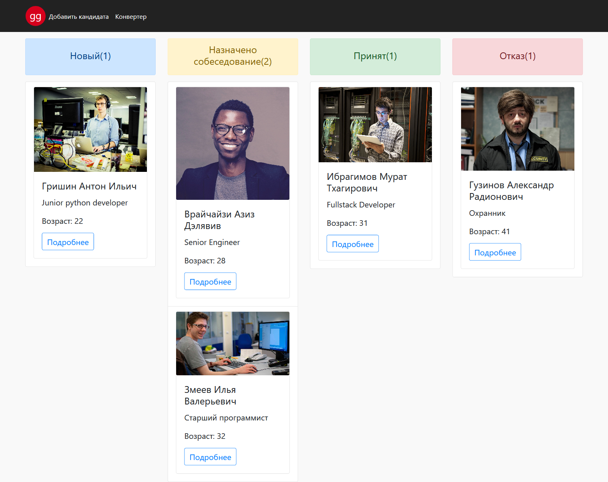
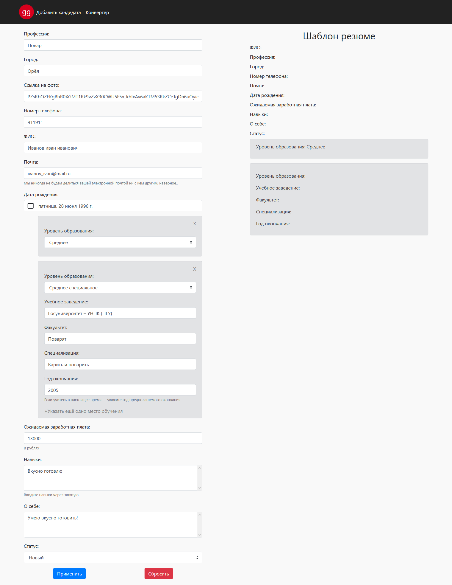
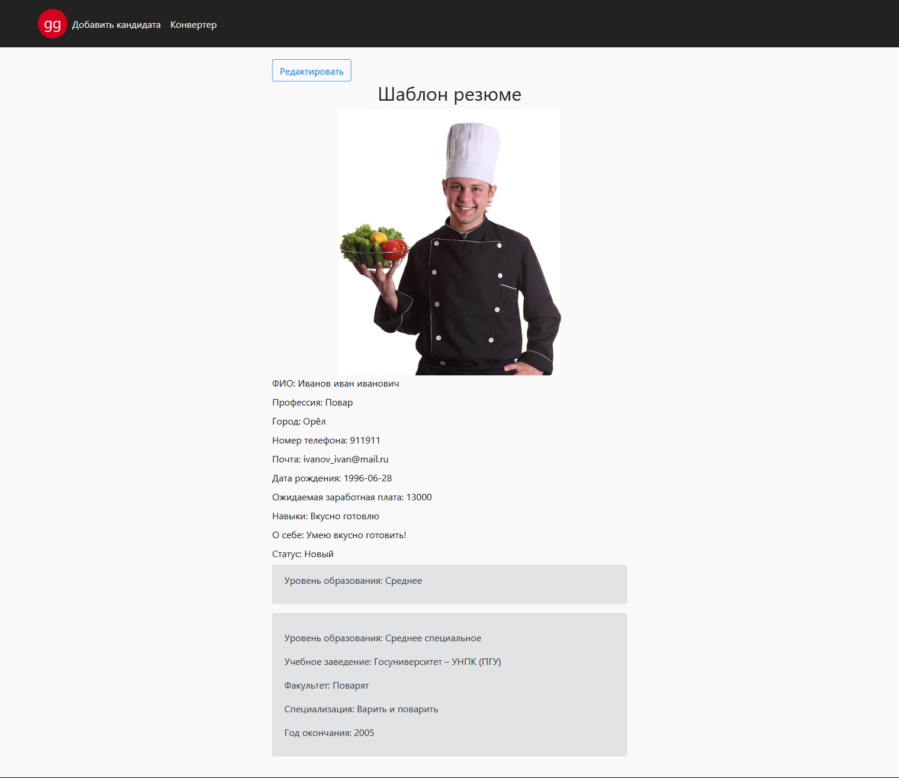
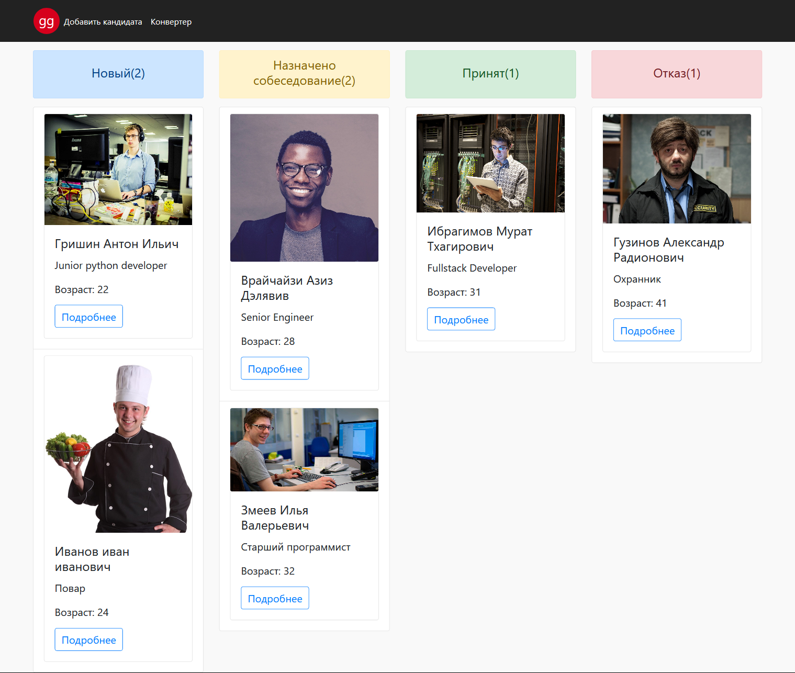
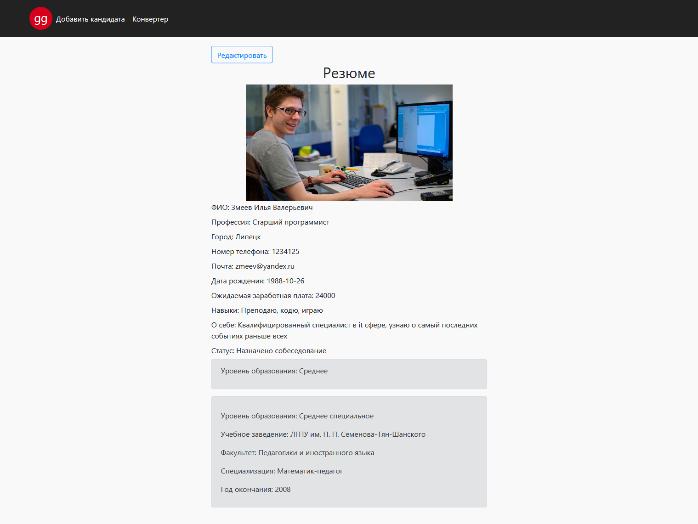

# practice_5
## API
```
https://github.com/theunclehonnor/vue_js_practice/tree/main/api
```
## Project setup
```
npm install
```
## Edit .env
```
Укажите ключ доступа VK API в файл `.env` 
VUE_APP_ACCESS_TOKEN_VK = Ваш ключ
```
### Project run
```
npm run serve
```
## Screenshots from the project
### Главная (draggable active)
` http://localhost:8080/`

### Добавить кандидата
` http://localhost:8080/add`
Заполняем данными:

После нажатия кнопки `Применить`:

### Главная с нашим добавленным кандидатом кандидатом
` http://localhost:8080/`

### Редактирование/просмотр резюме
` http://localhost:8080/:id/edit`
По нажатию кнопку `Редактировать` у нас будет даступна форма с нашими данными, которые можно будет изменить.


**P.S.Более подробный функционал можно увидеть после запуска проекта.**
